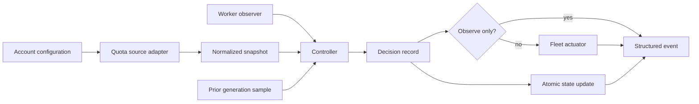

# Subscription Governor: build and production-readiness plan

## 1. Purpose

Build one account-aware governor that paces subscription quota for AI coding
workers using Claude Code with Anthropic, Codex, and Claude Code with Z.AI. The
governor must consume observable utilization and reset data, normalize every
source into one contract, and derive a safe worker target without confusing an
agent's wire protocol with the subscription account paying for its work.

This document is the implementation specification and delivery checklist. The
repository contains a working v0.1 baseline, but the project is not considered
production-ready until the v1 acceptance criteria in section 18 are complete.

Status notation:

- `[x]` exists in the v0.1 baseline;
- `[ ]` remains to be implemented or proven for v1;
- `[~]` exists but needs the hardening described here.

## 2. Goals

1. Govern `claude-anthropic`, `codex`, and `claude-zai` as distinct billable
   accounts in a single process.
2. Make desired utilization configurable at account and reset-window scope.
3. Pace consumption toward each reset rather than merely stopping at a fixed
   ceiling.
4. Allow every observable provider window to constrain the fleet.
5. Fail conservatively: stale, malformed, or missing quota data must never
   cause scale-up.
6. Keep provider credentials and site-local provider details out of logs,
   state, command arguments, examples, and public interfaces.
7. Support multiple fleet managers through small observer and actuator
   boundaries instead of embedding scheduler-specific behavior.
8. Be safe to run first in observation mode and straightforward to roll back.

## 3. Non-goals

- Scheduling individual prompts, models, or tasks.
- Combining independent subscriptions into a fungible quota pool.
- Predicting provider pricing or token costs when the subscription surface
  already reports utilization.
- Managing provider login workflows.
- Embedding private deployment topology or provider-specific infrastructure.
- Mutating a Kubernetes fleet directly. A Kubernetes installation should write
  desired state through its normal GitOps or controller boundary.
- Treating a successful poll as proof that actuation is safe.

## 4. Vocabulary and ownership boundaries

| Term | Meaning |
| --- | --- |
| Account | One independently metered subscription. It is the primary isolation key. |
| Source | Adapter that returns a normalized snapshot for exactly one account. |
| Window | One provider quota constraint with utilization and reset time. |
| Generation | The observations sharing the same window reset timestamp. |
| Observer | Adapter that reports the current worker count for an account. |
| Actuator | Adapter that publishes or applies a desired worker count. |
| Decision | Immutable explanation of one account's computed target. |
| Cycle | One collect, observe, evaluate, optionally actuate, and persist pass. |

Account identity is configured explicitly. A worker can speak an Anthropic
compatible protocol while consuming a non-Anthropic subscription; protocol
labels must never choose the quota source.

## 5. System architecture



Required separation:

- `source` owns provider transport and parsing only;
- `model` owns the provider-neutral contract;
- `controller` is a deterministic pure calculation;
- `fleet` owns worker observation and target application;
- `state` owns locking and durable samples;
- `main` owns orchestration, lifecycle, and exit behavior.

Provider branches are allowed in `source`; they are prohibited in the
controller and fleet modules.

## 6. Normalized quota contract

Every source must return exactly one snapshot:

```json
{
  "observed_at": "2026-09-12T12:00:00Z",
  "fresh": true,
  "windows": [
    {
      "id": "weekly",
      "used_fraction": 0.42,
      "resets_at": "2026-09-17T00:00:00Z",
      "duration_minutes": 10080,
      "reached": false
    }
  ]
}
```

### 6.1 Snapshot semantics

- `observed_at` is when the provider data was obtained, not when the controller
  happens to read a cache.
- `fresh` represents the source's own freshness judgment. The controller also
  enforces its configured maximum age.
- `windows` contains every active consumption limit relevant to the account.
- An empty `windows` array is invalid, not unlimited capacity.

### 6.2 Window semantics

- `id` is stable within one source and account. It need not be globally unique.
- `used_fraction` is finite and inclusive in `[0, 1]`.
- `resets_at` is an absolute UTC timestamp.
- `duration_minutes` is optional metadata; pacing depends on `resets_at`.
- `reached` is an explicit provider signal. The controller also treats
  `used_fraction >= target` as binding.
- Duplicate IDs, missing reset timestamps, non-finite values, and timestamps
  that cannot be parsed fail the snapshot.

### 6.3 Forward compatibility

New provider windows inherit account-level policy by default. They must not be
silently ignored because an older configuration does not name them. Operators
can explicitly disable a known non-binding window.

## 7. Provider source requirements

### 7.1 Claude Code with Anthropic

Baseline: `[~]`

The native adapter reads the Claude Code OAuth credential document, obtains a
valid access token, polls the configurable usage endpoint, and normalizes both
legacy named windows and generic limit entries.

Build requirements:

- [x] Expand `~` in the configured credential path.
- [x] Validate each access, refresh, and expiry field before it is used.
- [x] Refresh within five minutes of expiry.
- [x] Preserve unknown credential fields during an atomic refresh write.
- [x] Never include a token or response body in an error.
- [x] Accept null/inactive legacy windows without failing the entire account.
- [x] Prefer a generic limit over a same-ID legacy field.
- [ ] Lock refresh writes or otherwise prove safe coexistence with Claude Code.
- [ ] Preserve original file owner, mode, and parent-directory durability.
- [ ] Add recorded contract fixtures for legacy, generic, scoped, null, and
  forward-compatible payloads with all identifiers anonymized.
- [ ] Add mock HTTP tests for success, refresh, timeout, status failure, and
  malformed JSON.
- [ ] Document that endpoint compatibility is upstream-dependent and make an
  adapter failure non-actuating.

### 7.2 Codex

Baseline: `[~]`

The native adapter uses the installed Codex app-server process. It must perform
the protocol initialization handshake before requesting a full rate-limit
snapshot.

Build requirements:

- [x] Start `codex app-server --listen stdio://` without a shell.
- [x] Send `initialize`, wait for its response, then send `initialized`.
- [x] Call `account/rateLimits/read`.
- [x] Prefer every entry in `rateLimitsByLimitId` over the compatibility bucket.
- [x] Normalize primary and secondary windows as
  `<limit_id>.primary` and `<limit_id>.secondary`.
- [x] Bound request time and terminate the child on success or failure.
- [x] Keep authentication inside the Codex process.
- [ ] Add a fake app-server executable for handshake, interleaved notification,
  timeout, child-exit, sparse-window, and protocol-error tests.
- [ ] Replace per-poll process startup with a supervised long-lived session.
- [ ] Consume rate-limit update notifications while periodically reconciling
  with authoritative full reads.
- [ ] Restart with capped exponential backoff and jitter.
- [ ] Bound stdout frame size and ignore unrelated frames without unbounded
  buffering.

### 7.3 Claude Code with Z.AI

Baseline: `[x]` provider-neutral boundary; `[ ]` production collector contract.

No private endpoint or deployment component is part of this repository. A
site-local collector must emit the normalized contract through one of:

- `command`, with JSON on stdout and diagnostics on stderr;
- `normalized_file`, using an atomic producer write;
- `normalized_http`, on a loopback or otherwise access-controlled endpoint.

Build requirements:

- [x] Provide a `claude-zai` example using a generic command.
- [x] Keep provider credentials outside `subgov` and outside command arguments.
- [x] Apply exactly the same freshness and window validation as native sources.
- [ ] Publish a standalone JSON Schema for collector authors.
- [ ] Add contract tests that run an anonymous fixture-producing helper.
- [ ] Document secure HTTP deployment options; the v1 governor will not add
  arbitrary secret headers to configuration.
- [ ] Verify reset-generation transitions and percentage/absolute-usage
  normalization in the site-local collector before production rollout.

### 7.4 Generic source behavior

- Commands are argv arrays and are never interpreted by a shell.
- Source stdout contains one JSON document only.
- HTTP requests have mandatory finite timeouts and no automatic credential
  injection.
- Files and HTTP bodies have explicit maximum sizes in v1.
- Redirects are disabled for credential-bearing native requests and either
  disabled or same-origin-only for normalized HTTP.
- A source error affects only its account and cannot actuate its fleet.

## 8. Configuration contract

Configuration is versioned YAML with strict unknown-field rejection.

```yaml
version: 1
poll_interval_seconds: 300
state_path: ~/.local/state/subscription-governor/state.json

accounts:
  codex:
    source:
      type: codex_app_server
      executable: codex
      timeout_seconds: 15
    fleet:
      min_workers: 0
      max_workers: 12
      bootstrap_workers: 1
      max_scale_up_per_cycle: 2
      max_scale_down_per_cycle: 3
      observer:
        type: file
        path: /run/user/1000/codex-workers.current
      actuator:
        type: target_file
        path: /run/user/1000/codex-workers.target
    utilization:
      target_utilization: 0.90
      strategy: linear_to_reset
      stale_after_seconds: 900
      stale_behavior: min_workers
      minimum_sample_seconds: 300
      windows:
        codex.primary:
          reserve_fraction: 0.15
```

Validation rules:

- `version` must be supported exactly.
- At least one account is required.
- Account keys must be non-empty and unique by YAML mapping semantics.
- Exactly one account-level `target_utilization` or `reserve_fraction` is
  required.
- A window override may set at most one of those fields.
- Targets are in `(0, 1]`; reserves are in `[0, 1)`.
- `max_workers >= min_workers`.
- `bootstrap_workers <= max_workers`.
- Poll, staleness, sample, and transport durations are positive and bounded.
- Command argv is non-empty and contains no empty element.
- Command actuators contain `{desired_workers}` at least once.
- Paths expand only a leading `~/`; environment and shell expansion do not run.
- Account names and window IDs are included in errors, but source payloads and
  credentials are not.

Configuration compatibility policy:

- Adding an optional field with a safe default is backward-compatible.
- Renaming a field or changing semantics requires a new top-level version.
- Deprecated fields receive at least one minor release of warning before
  removal.
- `subgov check` validates without contacting sources or actuating fleets.

## 9. Controller algorithm

The controller must remain a pure function of configuration, current time,
current workers, one snapshot, and prior state. It performs no I/O.

### 9.1 Freshness gate

Treat a snapshot as stale when either:

```text
snapshot.fresh == false
now - observed_at > stale_after_seconds
```

For stale data:

- `hold` returns the current count;
- `min_workers` moves toward the minimum, still respecting the maximum
  scale-down step;
- neither behavior may increase workers;
- the stale sample does not replace the last good burn sample.

### 9.2 Policy resolution

For each observed window:

1. Load the account default.
2. Apply a matching window override.
3. Convert `reserve_fraction` to `1 - reserve_fraction`.
4. Skip only when `enabled: false` is explicit.
5. Fail if no enabled observed window remains.

### 9.3 Reset-generation safety

Two samples can be compared only when their `resets_at` values are identical.
A changed reset timestamp begins a new generation and returns to learning mode.
If a reset is due but the provider has not published a new generation, hold
the current count; do not extrapolate across the boundary.

### 9.4 Linear-to-reset pacing

Given current utilization `u1`, previous utilization `u0`, elapsed hours `dt`,
workers during the interval `w0`, target `t`, and hours until reset `h`:

```text
per_worker_burn = (u1 - u0) / dt / w0
required_burn   = max(0, t - u1) / h
raw_workers     = ceil(required_burn / per_worker_burn)
```

The estimate is usable only when:

- both samples are in the same generation;
- `dt >= minimum_sample_seconds`;
- `w0 > 0`;
- `u1 >= u0`;
- calculated values are finite;
- `per_worker_burn > 0`.

Otherwise:

- zero workers with no usable sample requests `bootstrap_workers`;
- non-zero workers hold while learning;
- a zero observed delta holds because quantized percentages do not prove zero
  consumption.

Floating-point ratios within `1e-9` of an integer use the nearest integer before
ceiling, preventing `1.0000000001` from allocating an unintended extra worker.

### 9.5 Ceiling-only policy

- Below target: request `max_workers`.
- At target or when explicitly reached: request `min_workers`.
- Per-cycle step limits still apply.

This strategy is intentionally aggressive and must not be the default.

### 9.6 Multi-window arbitration

Compute a raw desired count for every enabled window. The account result is the
minimum of those counts. Then:

1. clamp to `[min_workers, max_workers]`;
2. cap upward movement by `max_scale_up_per_cycle`;
3. cap downward movement by `max_scale_down_per_cycle`.

The emitted decision retains every per-window result and reason, even when a
different window wins.

### 9.7 Future estimator hardening

The two-point estimator is the v0.1 baseline. Before v1 production scaling:

- [ ] retain a bounded history per generation;
- [ ] model provider percentage quantization as an interval rather than a
  precise point;
- [ ] use a robust slope estimator that cannot learn zero from censored data;
- [ ] distinguish externally consumed quota from governed-worker burn where
  supporting signals exist;
- [ ] add hysteresis or minimum target dwell time after proving it does not
  violate binding windows;
- [ ] simulate estimator behavior against bursty, idle, and reset-heavy traces.

## 10. State and concurrency

State contains no credentials, raw provider bodies, prompts, or account tokens.
For each account it stores the latest good sample per window and last desired
target.

Requirements:

- [x] Default under the platform state directory.
- [x] Expand a configured leading `~/`.
- [x] Acquire a non-blocking exclusive lock associated with the state file.
- [x] Refuse a second governor using the same state path.
- [x] Serialize to a same-directory temporary file, `fsync`, and rename.
- [x] Keep account state isolated in a map keyed by configured account name.
- [ ] Add an explicit state schema version.
- [ ] Preserve the last valid state when a write fails.
- [ ] `fsync` the parent directory after rename on Unix.
- [ ] Set restrictive mode on state and lock files.
- [ ] Quarantine malformed state rather than silently starting empty.
- [ ] Test crash points before write, after write, after file sync, and after
  rename.

Only one controller may own a fleet. Different state paths are not permission
to run competing governors against the same actuator; deployment tooling must
enforce that operational invariant.

## 11. Fleet integration

### 11.1 Observers

Supported baseline observers:

- `static`: deterministic development and tests;
- `file`: one unsigned decimal integer;
- `command`: integer or `{"current_workers": N}` on stdout.

V1 requirements:

- bound file and stdout size;
- reject trailing non-whitespace data;
- apply a command timeout and kill the complete child process group;
- reject counts outside the configured fleet range unless a documented
  reconciliation mode is selected;
- capture no environment values in diagnostic output.

### 11.2 Actuators

Supported baseline actuators:

- `none`: no mutation;
- `target_file`: atomic integer handoff to another reconciler;
- `command`: direct argv execution with `{desired_workers}` substitution.

V1 requirements:

- do not invoke an actuator when desired equals observed;
- report `actuated: false` for `none` even when desired differs;
- pass no quota or credential data to actuator arguments;
- apply command timeout and process-group cleanup;
- record success only after a zero exit status or successful atomic rename;
- retain the prior state on actuation failure so the next cycle reconciles;
- optionally support an idempotency token through a non-secret environment
  variable after its contract is specified.

## 12. CLI and runtime behavior

Target command surface:

```text
subgov --config PATH check
subgov --config PATH snapshot ACCOUNT
subgov --config PATH run --once [--observe-only]
subgov --config PATH run [--observe-only]
```

### `check`

- Parse and validate configuration only.
- Perform no network requests, child execution, state writes, or actuation.
- Print the configuration version and account count.

### `snapshot`

- Collect exactly one named account.
- Print only the normalized snapshot.
- Perform no fleet observation, state write, or actuation.
- Never print authentication material or raw provider errors.

### `run --once`

- Acquire the state lock.
- Process every account even if another account fails.
- Save successful account observations once at the end of the cycle.
- Exit non-zero when any account fails.

### Continuous `run`

- Use a monotonic schedule so cycle duration does not accumulate drift.
- Add bounded jitter to avoid synchronized upstream polls.
- Handle SIGTERM/SIGINT by finishing or abandoning the current non-destructive
  operation, saving valid state, terminating children, and exiting promptly.
- Never overlap cycles for the same account.

Proposed stable exit codes:

| Code | Meaning |
| --- | --- |
| 0 | Success. |
| 2 | CLI or configuration error. |
| 3 | State ownership or persistence failure. |
| 4 | One or more source/observer failures. |
| 5 | Actuation failure. |

## 13. Observability

JSON Lines on stdout is the baseline event interface. Human diagnostics go to
stderr. Every event must contain `event`, `account` when applicable, and a UTC
timestamp.

Decision events include:

- observation time and freshness;
- current and desired workers;
- observe-only and actuated flags;
- every window's utilization, target, reset, proposed count, and reason;
- derived burn rate when usable;
- the binding window ID in v1.

Planned metrics:

- source success/failure and sample age by account;
- used and target fraction by account/window;
- seconds until reset;
- current and desired workers;
- decision reason and binding window;
- actuation attempts/failures;
- loop duration and skipped/late cycles.

Metrics must use configured account names only. They must not expose tokens,
provider payloads, model prompts, raw errors, or unbounded provider labels.

## 14. Security and privacy requirements

1. Secrets never appear in repository files, examples, argv, logs, state,
   metrics, panic messages, or test snapshots.
2. Native credentials are read only from their owning client's established
   credential boundary.
3. Generic HTTP does not accept plaintext credential configuration.
4. Configured commands execute directly without a shell.
5. OAuth and quota HTTP clients reject cross-origin redirects.
6. Source bodies, command output, and state files have bounded read sizes.
7. Temporary credential and state files use restrictive permissions and are
   cleaned up after failure.
8. Error types carry safe classifications; raw response bodies remain local to
   parsers and are discarded.
9. Fixtures are synthetic or irreversibly anonymized and contain no private
   infrastructure names.
10. Dependency advisories and license compatibility are checked before release.

## 15. Repository and module map

| Path | Responsibility |
| --- | --- |
| `src/model.rs` | Normalized quota types and validation-facing semantics. |
| `src/config.rs` | Versioned YAML types, defaults, strict validation, path expansion. |
| `src/source.rs` | Native and generic quota transports and normalization. |
| `src/controller.rs` | Pure pacing, reset, staleness, and arbitration decisions. |
| `src/state.rs` | Durable samples, atomic persistence, and exclusive ownership. |
| `src/fleet.rs` | Worker observers and target actuators. |
| `src/main.rs` | CLI, cycles, error isolation, and process lifecycle. |
| `examples/` | Safe configurations and synthetic normalized data. |
| `docs/notes/` | Operator-facing configuration and future design decisions. |
| `docs/research/` | Public provider-surface evidence and compatibility notes. |
| `docs/plan/plan.md` | Build sequence, contracts, and acceptance criteria. |

Provider-specific parsing should move into `src/source/` submodules during WP1
so no single file becomes the coupling point for unrelated providers.

## 16. Implementation work packages

### WP0: contracts and test harness

Dependencies: none.

- [x] Define Rust normalized snapshot/window types.
- [x] Define version-1 strict YAML types.
- [ ] Add `schema/quota-snapshot.schema.json`.
- [ ] Add `schema/governor-config.schema.json` generated or tested against Rust
  deserialization.
- [ ] Add reusable fake clock, fake source, observer, and actuator.
- [ ] Add a fixture-safety check for secrets and private identifiers.

Definition of done: schemas reject the same invalid inputs as Rust, and tests
can execute a complete cycle without network, wall-clock sleeps, or real child
processes.

### WP1: source adapter hardening

Dependencies: WP0.

- [~] Complete the Anthropic adapter requirements in section 7.1.
- [~] Complete the Codex adapter requirements in section 7.2.
- [~] Bound and harden generic command, file, and HTTP sources.
- [ ] Create contract-test suites per source.
- [ ] Add source-specific error enums with safe display text.

Definition of done: all success and failure paths are deterministic under test;
no adapter can leak a credential or leave a child process running.

### WP2: controller correctness

Dependencies: WP0.

- [x] Implement stale gate, policy inheritance, two strategies, reset-generation
  checks, bootstrap, and conservative multi-window selection.
- [x] Unit-test bootstrap, staleness, rate learning, and binding-window choice.
- [ ] Add table-driven boundary tests for every target/reserve limit.
- [ ] Add property tests for clamping and monotonic safety invariants.
- [ ] Add trace simulations and the robust estimator described in section 9.7.
- [ ] Emit the binding window explicitly.

Definition of done: property tests prove desired workers remain within bounds,
stale inputs never scale up, adding a binding window never raises the target,
and reset generations are never mixed.

### WP3: durable state

Dependencies: WP0 and WP2.

- [~] Version and harden state as specified in section 10.
- [ ] Add migration tests from every supported state version.
- [ ] Add corruption and crash-consistency tests.
- [ ] Add bounded per-generation history with retention limits.

Definition of done: state survives abrupt termination at each tested write
boundary without accepting partial JSON or silently losing the last good
generation.

### WP4: fleet boundaries

Dependencies: WP0.

- [~] Harden observers and actuators as specified in section 11.
- [ ] Introduce traits so controller-cycle tests use in-memory doubles.
- [ ] Add timeout and process-group termination support.
- [ ] Add idempotent reconciliation tests after partial actuation failure.

Definition of done: a hung or failed external helper is bounded, isolated to
its account, and cannot be reported as successful actuation.

### WP5: orchestration and lifecycle

Dependencies: WP1 through WP4.

- [x] Implement check, snapshot, one-shot, observe-only, and continuous modes.
- [x] Isolate account failures within a cycle.
- [ ] Add signal-aware shutdown, monotonic scheduling, and bounded jitter.
- [ ] Implement stable exit codes and structured error events.
- [ ] Prevent state advancement when actuation fails.
- [ ] Add cycle-level integration tests using injected adapters.

Definition of done: continuous operation exits cleanly, never overlaps account
cycles, and produces deterministic one-shot behavior in tests.

### WP6: observability and operations

Dependencies: WP5.

- [ ] Stabilize the JSONL event schema.
- [ ] Add metrics and a minimal readiness/status surface.
- [ ] Supply a hardened service example with restart limits and filesystem
  protections.
- [ ] Write runbooks for stale sources, authentication expiry, reset rollover,
  conflicting controllers, and rollback.
- [ ] Document backup and removal of state.

Definition of done: an operator can distinguish healthy learning, intentional
hold, provider failure, stale drain, and actuation failure without inspecting
credentials or raw provider traffic.

### WP7: release engineering

Dependencies: WP0 through WP6.

- [ ] Pin and audit dependencies.
- [ ] Verify formatting, Clippy, tests, docs, schemas, and secret scanning in the
  configured Argo workflow.
- [ ] Produce versioned Linux artifacts with checksums and provenance.
- [ ] Add changelog and compatibility policy.
- [ ] Cut `v1.0.0-rc.1` for observation-only rollout.

Definition of done: a clean clone can reproduce the release artifact and every
published checksum from documented commands.

### WP8: staged production rollout

Dependencies: WP7.

1. Install the release candidate without stopping existing governors.
2. Run snapshots only and compare normalized windows with provider-visible
   values.
3. Stop the existing governor for one account before starting `subgov` in
   observe-only mode for that same account.
4. Observe at least two useful samples and one reset generation.
5. Compare recommended targets with recorded worker activity and quota deltas.
6. Enable a target-file actuator for one low-risk account.
7. Enable remaining accounts one at a time.
8. Maintain a one-command rollback to observe-only or the previous controller.
9. Retire old control loops only after the v1 acceptance window passes.

Definition of done: all three accounts run for seven consecutive days, including
at least one reset each, without conflicting actuation, stale-driven scale-up,
or unaccounted quota crossover.

## 17. Test strategy

### 17.1 Unit tests

- Configuration defaulting, inheritance, strictness, and invalid boundaries.
- Provider payload normalization and forward-compatible unknown fields.
- Every decision reason and boundary condition.
- Step limiting at `u32` boundaries.
- Reset changes, future/expired reset times, clock skew, and stale timestamps.
- Worker count parsing and placeholder substitution.

### 17.2 Property tests

For generated valid configurations and snapshots:

- desired count is always within fleet bounds;
- stale decisions never exceed current workers;
- reached/at-target windows never request above the minimum before step limits;
- adding another enabled window cannot increase the raw account target;
- disabling one window cannot make another window's calculation less safe;
- state from another account cannot change the decision.

### 17.3 Contract tests

- Anonymous Anthropic legacy and generic payload fixtures.
- Scripted Codex app-server JSONL exchanges.
- Normalized file, command, and HTTP producer fixtures.
- Unknown windows and extra fields.
- Missing fields, oversized bodies, redirects, timeout, and malformed data.

### 17.4 Integration tests

- Full observe-only cycle across three accounts.
- One account failure while two succeed and persist.
- Actuator failure with unchanged durable state.
- Second-process lock refusal.
- Graceful termination during poll and between cycles.
- Atomic target/state readers never observe partial contents.

### 17.5 Soak and simulation tests

Replay synthetic week-long traces with:

- steady burn;
- bursty workers;
- integer-quantized percentages;
- interactive consumption outside governed workers;
- source gaps and stale recovery;
- clock skew;
- reset timestamp shifts;
- multiple simultaneous binding windows.

Success means utilization approaches the configured target without exceeding it
in the safety scenarios, oscillation remains bounded, and no stale interval
causes scale-up.

## 18. V1 acceptance criteria

V1 is ready only when all of the following are true:

- [ ] A clean clone builds using the documented stable Rust toolchain.
- [ ] `cargo fmt --all -- --check` passes.
- [ ] `cargo clippy --all-targets --all-features -- -D warnings` passes.
- [ ] `cargo test --all-targets --all-features` passes.
- [ ] Configuration and normalized snapshot schemas are published and tested.
- [ ] All three account examples pass `subgov check`.
- [ ] Native source contract and failure tests pass without live credentials.
- [ ] The generic Z.AI example contains no private endpoint, credential, or
  deployment identifier.
- [ ] Stale, failed, empty, malformed, and unknown-window inputs are covered.
- [ ] Property tests prove the controller safety invariants.
- [ ] External commands have timeouts and complete process cleanup.
- [ ] State has a version, migration path, restrictive permissions, and crash
  tests.
- [ ] Observe-only mode is proven to perform no actuator mutation.
- [ ] JSONL and metrics contain no secrets or unbounded provider labels.
- [ ] Security/advisory and fixture-secret scans pass.
- [ ] Service, operations, and rollback documentation is complete.
- [ ] The release candidate completes the staged acceptance window in WP8.

## 19. Build and verification commands

Development baseline:

```console
cargo fmt --all -- --check
cargo clippy --all-targets --all-features -- -D warnings
cargo test --all-targets --all-features
cargo run -- --config examples/claude-code.yaml check
cargo run -- --config examples/codex.yaml check
cargo run -- --config examples/claude-zai.yaml check
cargo run -- --config examples/all-three.yaml run --once --observe-only
```

Before running the final command, use a temporary state path or remove only the
test-generated state afterward. Production verification must begin with
`--observe-only`.

## 20. Recommended implementation order

The critical path is:

```text
WP0 contracts
  ├── WP1 sources ──┐
  ├── WP2 control ──┼── WP5 runtime ── WP6 operations ── WP7 release ── WP8 rollout
  ├── WP3 state ────┤
  └── WP4 fleet ────┘
```

WP1 through WP4 can proceed independently after the contracts and test doubles
are fixed. Controller correctness and crash-safe state are release blockers;
metrics or service packaging must not be used to mask gaps in either.

## 21. Decisions intentionally deferred

These require evidence from observation-mode traces:

- exact robust estimator and quantization interval model;
- hysteresis and target dwell duration;
- poll jitter range;
- bounded history length;
- whether external-consumption estimation is reliable enough to expose;
- whether a long-lived Codex session materially improves reliability;
- which fleet-manager-specific adapters merit first-party support.

Record each decision in `docs/notes/` with the trace or test evidence that
supports it. Changes to the normalized contract or safety invariants require an
explicit plan revision.
