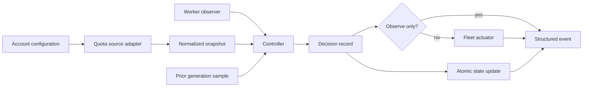
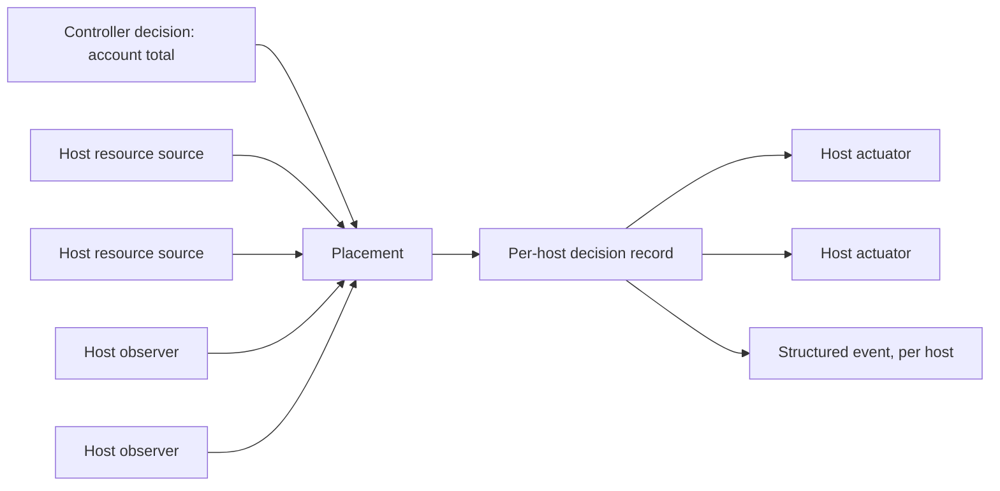

# Subscription Governor: build and production-readiness plan

## 1. Purpose

Build one account-aware governor that paces subscription quota for AI coding
workers using Claude Code with Anthropic, Codex, and Claude Code with Z.AI. The
governor must consume observable utilization and reset data, normalize every
source into one contract, and derive a safe worker target without confusing an
agent's wire protocol with the subscription account paying for its work.

This document is the implementation specification and delivery checklist. The
repository contains a working v0.1 baseline, but the project is not considered
production-ready until the v1 acceptance criteria in section 18 are complete.

Status notation:

- `[x]` exists in the v0.1 baseline;
- `[ ]` remains to be implemented or proven for v1;
- `[~]` exists but needs the hardening described here.

## 2. Goals

1. Govern `claude-anthropic`, `codex`, and `claude-zai` as distinct billable
   accounts in a single process.
2. Make desired utilization configurable at account and reset-window scope.
3. Pace consumption toward each reset rather than merely stopping at a fixed
   ceiling.
4. Allow every observable provider window to constrain the fleet.
5. Fail conservatively: stale, malformed, or missing quota data must never
   cause scale-up.
6. Keep provider credentials and site-local provider details out of logs,
   state, command arguments, examples, and public interfaces.
7. Support multiple fleet managers through small observer and actuator
   boundaries instead of embedding scheduler-specific behavior.
8. Be safe to run first in observation mode and straightforward to roll back.
9. Extend governed capacity beyond subscription quota to per-host machine
   resources (CPU, RAM), and distribute each account's quota-safe worker
   total across that account's configured hosts by available headroom —
   bin-packing workers onto hosts with room rather than ever scaling the
   account total past what quota already allows. See §22.

## 3. Non-goals

- Scheduling individual prompts, models, or tasks.
- Combining independent subscriptions into a fungible quota pool.
- Predicting provider pricing or token costs when the subscription surface
  already reports utilization.
- Managing provider login workflows.
- Redeeming, consuming, or otherwise mutating banked reset credits. The
  governor may recommend redemption, but a human performs it.
- Embedding private deployment topology or provider-specific infrastructure.
- Mutating a Kubernetes fleet directly. A Kubernetes installation should write
  desired state through its normal GitOps or controller boundary.
- Treating a successful poll as proof that actuation is safe.
- Auto-discovering hosts or measuring a host's total capacity. Hosts and their
  resource ceilings are configured explicitly, the same as accounts and their
  windows.
- Coordinating NEEDLE bead claims or repository work across hosts. Placement
  sets a worker *count* per host; avoiding duplicate claims on a repository
  worked from more than one host remains an operational NEEDLE practice
  outside this project (see §22.9).
- Cost- or task-aware placement optimization beyond proportional headroom
  distribution in the initial release (see §22.7 future hardening).

## 4. Vocabulary and ownership boundaries

| Term | Meaning |
| --- | --- |
| Account | One independently metered subscription. It is the primary isolation key. |
| Source | Adapter that returns a normalized snapshot for exactly one account. |
| Window | One provider quota constraint with utilization and reset time. |
| Generation | The observations sharing the same window reset timestamp. |
| Observer | Adapter that reports the current worker count for an account. |
| Actuator | Adapter that publishes or applies a desired worker count. |
| Decision | Immutable explanation of one account's computed target. |
| Cycle | One collect, observe, evaluate, optionally actuate, and persist pass. |
| Host | One machine (or other reachable target) where an account's workers may run. Configured explicitly per account, never auto-discovered. |
| Resource snapshot | A host's observed CPU/RAM headroom, normalized like a quota snapshot but with no reset time. |
| Placement | The pure function that distributes an account's quota-safe total across its hosts by resource headroom. Runs strictly after the controller and never raises its total. |
| Binding resource | The scarcer of a host's CPU or RAM headroom for one placement cycle — mirrors "binding window." |

Account identity is configured explicitly. A worker can speak an Anthropic
compatible protocol while consuming a non-Anthropic subscription; protocol
labels must never choose the quota source.

## 5. System architecture


```mermaid
flowchart LR
    A[Account configuration] --> S[Quota source adapter]
    S --> N[Normalized snapshot]
    O[Worker observer] --> C[Controller]
    N --> C
    P[Prior generation sample] --> C
    C --> D[Decision record]
    D --> X{Observe only?}
    X -->|yes| L[Structured event]
    X -->|no| T[Fleet actuator]
    D --> W[Atomic state update]
    T --> L
    W --> L
```

Required separation:

- `source` owns provider transport and parsing only;
- `model` owns the provider-neutral contract;
- `controller` is a deterministic pure calculation;
- `fleet` owns worker observation and target application;
- `state` owns locking and durable samples;
- `main` owns orchestration, lifecycle, and exit behavior.

Provider branches are allowed in `source`; they are prohibited in the
controller and fleet modules.

Resource-aware multi-host placement extends this same pipeline with a second,
strictly downstream pure stage (`placement`) that runs after the controller
and before the fleet actuators; it never feeds back into the controller. See
§22.

## 6. Normalized quota contract

Every source must return exactly one snapshot:

```json
{
  "observed_at": "2026-09-12T12:00:00Z",
  "fresh": true,
  "windows": [
    {
      "id": "weekly",
      "used_fraction": 0.42,
      "resets_at": "2026-09-17T00:00:00Z",
      "duration_minutes": 10080,
      "reached": false
    }
  ]
}
```

### 6.1 Snapshot semantics

- `observed_at` is when the provider data was obtained, not when the controller
  happens to read a cache.
- `fresh` represents the source's own freshness judgment. The controller also
  enforces its configured maximum age.
- `windows` contains every active consumption limit relevant to the account.
- An empty `windows` array is invalid, not unlimited capacity.

### 6.2 Window semantics

- `id` is stable within one source and account. It need not be globally unique.
- `used_fraction` is finite and inclusive in `[0, 1]`.
- `resets_at` is an absolute UTC timestamp.
- `duration_minutes` is optional metadata; pacing depends on `resets_at`.
- `reached` is an explicit provider signal. The controller also treats
  `used_fraction >= target` as binding.
- Duplicate IDs, missing reset timestamps, non-finite values, and timestamps
  that cannot be parsed fail the snapshot.

### 6.3 Forward compatibility

New provider windows inherit account-level policy by default. They must not be
silently ignored because an older configuration does not name them. Operators
can explicitly disable a known non-binding window.

## 7. Provider source requirements

### 7.1 Claude Code with Anthropic

Baseline: `[~]`

The native adapter reads the Claude Code OAuth credential document, obtains a
valid access token, polls the configurable usage endpoint, and normalizes both
legacy named windows and generic limit entries.

Build requirements:

- [x] Expand `~` in the configured credential path.
- [x] Validate each access, refresh, and expiry field before it is used.
- [x] Refresh within five minutes of expiry.
- [x] Preserve unknown credential fields during an atomic refresh write.
- [x] Never include a token or response body in an error.
- [x] Accept null/inactive legacy windows without failing the entire account.
- [x] Prefer a generic limit over a same-ID legacy field.
- [ ] Lock refresh writes or otherwise prove safe coexistence with Claude Code.
- [ ] Preserve original file owner, mode, and parent-directory durability.
- [ ] Add recorded contract fixtures for legacy, generic, scoped, null, and
  forward-compatible payloads with all identifiers anonymized.
- [ ] Add mock HTTP tests for success, refresh, timeout, status failure, and
  malformed JSON.
- [ ] Document that endpoint compatibility is upstream-dependent and make an
  adapter failure non-actuating.

### 7.2 Codex

Baseline: `[~]`

The native adapter uses the installed Codex app-server process. It must perform
the protocol initialization handshake before requesting a full rate-limit
snapshot.

Build requirements:

- [x] Start `codex app-server --listen stdio://` without a shell.
- [x] Send `initialize`, wait for its response, then send `initialized`.
- [x] Call `account/rateLimits/read`.
- [x] Prefer every entry in `rateLimitsByLimitId` over the compatibility bucket.
- [x] Normalize primary and secondary windows as
  `<limit_id>.primary` and `<limit_id>.secondary`.
- [x] Bound request time and terminate the child on success or failure.
- [x] Keep authentication inside the Codex process.
- [x] Capture the authoritative banked-reset balance and optional expiration
  details from `account/rateLimits/read`.
- [x] Support a configurable banked-reset pace with a 2x default floor and
  deadline-aware acceleration.
- [x] Emit a structured manual-redemption recommendation at the configured
  utilization threshold and drain the governed fleet at that boundary.
- [x] Exclude reset-credit consumption from configuration, CLI commands,
  provider adapters, and state. Redemption remains human-controlled per
  [ADR-0001](../adr/0001-human-controlled-reset-redemption.md).
- [ ] Add a fake app-server executable for handshake, interleaved notification,
  timeout, child-exit, sparse-window, and protocol-error tests.
- [ ] Replace per-poll process startup with a supervised long-lived session.
- [ ] Consume rate-limit update notifications while periodically reconciling
  with authoritative full reads.
- [ ] Restart with capped exponential backoff and jitter.
- [ ] Bound stdout frame size and ignore unrelated frames without unbounded
  buffering.

### 7.3 Claude Code with Z.AI

Baseline: `[x]` provider-neutral boundary; `[ ]` production collector contract.

No private endpoint or deployment component is part of this repository. A
site-local collector must emit the normalized contract through one of:

- `command`, with JSON on stdout and diagnostics on stderr;
- `normalized_file`, using an atomic producer write;
- `normalized_http`, on a loopback or otherwise access-controlled endpoint.

Build requirements:

- [x] Provide a `claude-zai` example using a generic command.
- [x] Keep provider credentials outside `subgov` and outside command arguments.
- [x] Apply exactly the same freshness and window validation as native sources.
- [ ] Publish a standalone JSON Schema for collector authors.
- [ ] Add contract tests that run an anonymous fixture-producing helper.
- [ ] Document secure HTTP deployment options; the v1 governor will not add
  arbitrary secret headers to configuration.
- [ ] Verify reset-generation transitions and percentage/absolute-usage
  normalization in the site-local collector before production rollout.

### 7.4 Generic source behavior

- Commands are argv arrays and are never interpreted by a shell.
- Source stdout contains one JSON document only.
- HTTP requests have mandatory finite timeouts and no automatic credential
  injection.
- Files and HTTP bodies have explicit maximum sizes in v1.
- Redirects are disabled for credential-bearing native requests and either
  disabled or same-origin-only for normalized HTTP.
- A source error affects only its account and cannot actuate its fleet.

## 8. Configuration contract

Configuration is versioned YAML with strict unknown-field rejection.

```yaml
version: 1
poll_interval_seconds: 300
state_path: ~/.local/state/subscription-governor/state.json

accounts:
  codex:
    source:
      type: codex_app_server
      executable: codex
      timeout_seconds: 15
    fleet:
      min_workers: 0
      max_workers: 12
      bootstrap_workers: 1
      max_scale_up_per_cycle: 2
      max_scale_down_per_cycle: 3
      observer:
        type: file
        path: /run/user/1000/codex-workers.current
      actuator:
        type: target_file
        path: /run/user/1000/codex-workers.target
    utilization:
      target_utilization: 0.90
      strategy: linear_to_reset
      stale_after_seconds: 900
      stale_behavior: min_workers
      minimum_sample_seconds: 300
      windows:
        codex.primary:
          reserve_fraction: 0.15
```

Validation rules:

- `version` must be supported exactly.
- At least one account is required.
- Account keys must be non-empty and unique by YAML mapping semantics.
- Exactly one account-level `target_utilization` or `reserve_fraction` is
  required.
- A window override may set at most one of those fields.
- Targets are in `(0, 1]`; reserves are in `[0, 1)`.
- `max_workers >= min_workers`.
- `bootstrap_workers <= max_workers`.
- Poll, staleness, sample, and transport durations are positive and bounded.
- Command argv is non-empty and contains no empty element.
- Command actuators contain `{desired_workers}` at least once.
- Paths expand only a leading `~/`; environment and shell expansion do not run.
- Account names and window IDs are included in errors, but source payloads and
  credentials are not.

Configuration compatibility policy:

- Adding an optional field with a safe default is backward-compatible.
- Renaming a field or changing semantics requires a new top-level version.
- Deprecated fields receive at least one minor release of warning before
  removal.
- `subgov check` validates without contacting sources or actuating fleets.

## 9. Controller algorithm

The controller must remain a pure function of configuration, current time,
current workers, one snapshot, and prior state. It performs no I/O.

### 9.1 Freshness gate

Treat a snapshot as stale when either:

```text
snapshot.fresh == false
now - observed_at > stale_after_seconds
```

For stale data:

- `hold` returns the current count;
- `min_workers` moves toward the minimum, still respecting the maximum
  scale-down step;
- neither behavior may increase workers;
- the stale sample does not replace the last good burn sample.

### 9.2 Policy resolution

For each observed window:

1. Load the account default.
2. Apply a matching window override.
3. Convert `reserve_fraction` to `1 - reserve_fraction`.
4. Skip only when `enabled: false` is explicit.
5. Fail if no enabled observed window remains.

### 9.3 Reset-generation safety

Two samples can be compared only when their `resets_at` values are identical.
A changed reset timestamp begins a new generation and returns to learning mode.
If a reset is due but the provider has not published a new generation, hold
the current count; do not extrapolate across the boundary.

### 9.4 Linear-to-reset pacing

Given current utilization `u1`, previous utilization `u0`, elapsed hours `dt`,
workers during the interval `w0`, target `t`, and hours until reset `h`:

```text
per_worker_burn = (u1 - u0) / dt / w0
required_burn   = max(0, t - u1) / h
raw_workers     = ceil(required_burn / per_worker_burn)
```

The estimate is usable only when:

- both samples are in the same generation;
- `dt >= minimum_sample_seconds`;
- `w0 > 0`;
- `u1 >= u0`;
- calculated values are finite;
- `per_worker_burn > 0`.

Otherwise:

- zero workers with no usable sample requests `bootstrap_workers`;
- non-zero workers hold while learning;
- a zero observed delta holds because quantized percentages do not prove zero
  consumption.

Floating-point ratios within `1e-9` of an integer use the nearest integer before
ceiling, preventing `1.0000000001` from allocating an unintended extra worker.

### 9.5 Ceiling-only policy

- Below target: request `max_workers`.
- At target or when explicitly reached: request `min_workers`.
- Per-cycle step limits still apply.

This strategy is intentionally aggressive and must not be the default.

### 9.6 Multi-window arbitration

Compute a raw desired count for every enabled window. The account result is the
minimum of those counts. Then:

1. clamp to `[min_workers, max_workers]`;
2. cap upward movement by `max_scale_up_per_cycle`;
3. cap downward movement by `max_scale_down_per_cycle`.

The emitted decision retains every per-window result and reason, even when a
different window wins.

### 9.7 Banked-reset pacing and human handoff

When `banked_resets.enabled` and `available_count > 0`, the controller raises
the weekly target to at least `redeem_at_utilization` and computes:

```text
minimum banked burn = minimum_pace_multiplier * target / window duration
expiry burn         = remaining generations / time to expiry safety deadline
required banked burn = max(minimum banked burn, each known expiry burn)
```

The resulting worker count is a floor on ordinary weekly pacing, but a reached
shorter window remains binding. At the redemption threshold, the controller
sets `manual_redemption_recommended: true` and drains toward `min_workers`.
The governor then waits for a human redemption and observes the new generation
through the normal read path. It has no reset-credit mutation path. This
boundary is normative per
[ADR-0001](../adr/0001-human-controlled-reset-redemption.md).

### 9.8 Future estimator hardening

The two-point estimator is the v0.1 baseline. Before v1 production scaling:

- [ ] retain a bounded history per generation;
- deferred — model provider percentage quantization as an interval rather
  than a precise point (the exact interval model is one of §21's
  evidence-gated forks; not a bead until observation-mode traces exist);
- [ ] use a robust slope estimator that cannot learn zero from censored data
  (the general property is buildable now; only the exact parametric form is
  the §21 fork, refined later with evidence);
- deferred — distinguish externally consumed quota from governed-worker burn
  where supporting signals exist (§21: "whether external-consumption
  estimation is reliable enough to expose" is unresolved, not a bead);
- deferred — add hysteresis or minimum target dwell time after proving it
  does not violate binding windows (§21: the proof this bullet requires
  doesn't exist yet, so there is nothing to build against);
- [ ] simulate estimator behavior against bursty, idle, and reset-heavy traces.

The three "deferred" bullets above are the same forks §21 already lists as
needing observation-mode evidence before they can be decided, not merely
unbuilt work — per this project's rule that an unresolved decision is never a
bead, they stay here as plan text rather than becoming one. The other three
bullets are concrete, buildable requirements and are beaded.

## 10. State and concurrency

State contains no credentials, raw provider bodies, prompts, or account tokens.
For each account it stores the latest good sample per window and last desired
target.

Requirements:

- [x] Default under the platform state directory.
- [x] Expand a configured leading `~/`.
- [x] Acquire a non-blocking exclusive lock associated with the state file.
- [x] Refuse a second governor using the same state path.
- [x] Serialize to a same-directory temporary file, `fsync`, and rename.
- [x] Keep account state isolated in a map keyed by configured account name.
- [ ] Add an explicit state schema version.
- [ ] Preserve the last valid state when a write fails.
- [ ] `fsync` the parent directory after rename on Unix.
- [ ] Set restrictive mode on state and lock files.
- [ ] Quarantine malformed state rather than silently starting empty.
- [ ] Test crash points before write, after write, after file sync, and after
  rename.

Only one controller may own a fleet. Different state paths are not permission
to run competing governors against the same actuator; deployment tooling must
enforce that operational invariant.

## 11. Fleet integration

### 11.1 Observers

Supported baseline observers:

- `static`: deterministic development and tests;
- `file`: one unsigned decimal integer;
- `command`: integer or `{"current_workers": N}` on stdout.

V1 requirements:

- bound file and stdout size;
- reject trailing non-whitespace data;
- apply a command timeout and kill the complete child process group;
- reject counts outside the configured fleet range unless a documented
  reconciliation mode is selected;
- capture no environment values in diagnostic output.

### 11.2 Actuators

Supported baseline actuators:

- `none`: no mutation;
- `target_file`: atomic integer handoff to another reconciler;
- `command`: direct argv execution with `{desired_workers}` substitution.

V1 requirements:

- do not invoke an actuator when desired equals observed;
- report `actuated: false` for `none` even when desired differs;
- pass no quota or credential data to actuator arguments;
- apply command timeout and process-group cleanup;
- record success only after a zero exit status or successful atomic rename;
- retain the prior state on actuation failure so the next cycle reconciles;
- optionally support an idempotency token through a non-secret environment
  variable after its contract is specified.

## 12. CLI and runtime behavior

Target command surface:

```text
subgov --config PATH check
subgov --config PATH snapshot ACCOUNT
subgov --config PATH run --once [--observe-only]
subgov --config PATH run [--observe-only]
```

### `check`

- Parse and validate configuration only.
- Perform no network requests, child execution, state writes, or actuation.
- Print the configuration version and account count.

### `snapshot`

- Collect exactly one named account.
- Print only the normalized snapshot.
- Perform no fleet observation, state write, or actuation.
- Never print authentication material or raw provider errors.

### `run --once`

- Acquire the state lock.
- Process every account even if another account fails.
- Save successful account observations once at the end of the cycle.
- Exit non-zero when any account fails.

### Continuous `run`

- Use a monotonic schedule so cycle duration does not accumulate drift.
- Add bounded jitter to avoid synchronized upstream polls.
- Handle SIGTERM/SIGINT by finishing or abandoning the current non-destructive
  operation, saving valid state, terminating children, and exiting promptly.
- Never overlap cycles for the same account.

Proposed stable exit codes:

| Code | Meaning |
| --- | --- |
| 0 | Success. |
| 2 | CLI or configuration error. |
| 3 | State ownership or persistence failure. |
| 4 | One or more source/observer failures. |
| 5 | Actuation failure. |

## 13. Observability

JSON Lines on stdout is the baseline event interface. Human diagnostics go to
stderr. Every event must contain `event`, `account` when applicable, and a UTC
timestamp.

Decision events include:

- observation time and freshness;
- current and desired workers;
- observe-only and actuated flags;
- every window's utilization, target, reset, proposed count, and reason;
- derived burn rate when usable;
- the binding window ID in v1.
- banked-reset balance, expiry pressure, and whether manual redemption is
  recommended.

Planned metrics:

- source success/failure and sample age by account;
- used and target fraction by account/window;
- seconds until reset;
- current and desired workers;
- decision reason and binding window;
- actuation attempts/failures;
- loop duration and skipped/late cycles.

Metrics must use configured account names only. They must not expose tokens,
provider payloads, model prompts, raw errors, or unbounded provider labels.

## 14. Security and privacy requirements

1. Secrets never appear in repository files, examples, argv, logs, state,
   metrics, panic messages, or test snapshots.
2. Native credentials are read only from their owning client's established
   credential boundary.
3. Generic HTTP does not accept plaintext credential configuration.
4. Configured commands execute directly without a shell.
5. OAuth and quota HTTP clients reject cross-origin redirects.
6. Source bodies, command output, and state files have bounded read sizes.
7. Temporary credential and state files use restrictive permissions and are
   cleaned up after failure.
8. Error types carry safe classifications; raw response bodies remain local to
   parsers and are discarded.
9. Fixtures are synthetic or irreversibly anonymized and contain no private
   infrastructure names.
10. Dependency advisories and license compatibility are checked before release.

## 15. Repository and module map

| Path | Responsibility |
| --- | --- |
| `src/model.rs` | Normalized quota types and validation-facing semantics. |
| `src/config.rs` | Versioned YAML types, defaults, strict validation, path expansion. |
| `src/source.rs` | Native and generic quota transports and normalization. |
| `src/controller.rs` | Pure pacing, reset, staleness, and arbitration decisions. |
| `src/placement.rs` | Pure multi-host bin-packing of one account's controller total by resource headroom (§22.7). |
| `src/state.rs` | Durable samples, atomic persistence, and exclusive ownership. |
| `src/fleet.rs` | Worker observers and target actuators, including the NEEDLE-native pair (`src/fleet/needle.rs`, §22.9). |
| `src/main.rs` | CLI, cycles, error isolation, and process lifecycle. |
| `examples/` | Safe configurations and synthetic normalized data. |
| `docs/notes/` | Operator-facing configuration and future design decisions. |
| `docs/adr/` | Accepted architectural decisions and their consequences. |
| `docs/research/` | Public provider-surface evidence and compatibility notes. |
| `docs/plan/plan.md` | Build sequence, contracts, and acceptance criteria. |

Provider-specific parsing should move into `src/source/` submodules during WP1
so no single file becomes the coupling point for unrelated providers.

## 16. Implementation work packages

### WP0: contracts and test harness

Dependencies: none.

- [x] Define Rust normalized snapshot/window types.
- [x] Define version-1 strict YAML types.
- [ ] Add `schema/quota-snapshot.schema.json`.
- [ ] Add `schema/governor-config.schema.json` generated or tested against Rust
  deserialization.
- [ ] Add reusable fake clock, fake source, observer, and actuator.
- [ ] Add a fixture-safety check for secrets and private identifiers.

Definition of done: schemas reject the same invalid inputs as Rust, and tests
can execute a complete cycle without network, wall-clock sleeps, or real child
processes.

### WP1: source adapter hardening

Dependencies: WP0.

- [~] Complete the Anthropic adapter requirements in section 7.1.
- [~] Complete the Codex adapter requirements in section 7.2.
- [~] Bound and harden generic command, file, and HTTP sources.
- [ ] Create contract-test suites per source.
- [ ] Add source-specific error enums with safe display text.

Definition of done: all success and failure paths are deterministic under test;
no adapter can leak a credential or leave a child process running.

### WP2: controller correctness

Dependencies: WP0.

- [x] Implement stale gate, policy inheritance, two strategies, reset-generation
  checks, bootstrap, and conservative multi-window selection.
- [x] Unit-test bootstrap, staleness, rate learning, and binding-window choice.
- [ ] Add table-driven boundary tests for every target/reserve limit.
- [ ] Add property tests for clamping and monotonic safety invariants.
- [ ] Add trace simulations and the robust estimator described in section 9.7.
- [ ] Emit the binding window explicitly.

Definition of done: property tests prove desired workers remain within bounds,
stale inputs never scale up, adding a binding window never raises the target,
and reset generations are never mixed.

### WP3: durable state

Dependencies: WP0 and WP2.

- [~] Version and harden state as specified in section 10.
- [ ] Add migration tests from every supported state version.
- [ ] Add corruption and crash-consistency tests.
- [ ] Add bounded per-generation history with retention limits.

Definition of done: state survives abrupt termination at each tested write
boundary without accepting partial JSON or silently losing the last good
generation.

### WP4: fleet boundaries

Dependencies: WP0.

- [~] Harden observers and actuators as specified in section 11.
- [ ] Introduce traits so controller-cycle tests use in-memory doubles.
- [ ] Add timeout and process-group termination support.
- [ ] Add idempotent reconciliation tests after partial actuation failure.

Definition of done: a hung or failed external helper is bounded, isolated to
its account, and cannot be reported as successful actuation.

### WP5: orchestration and lifecycle

Dependencies: WP1 through WP4.

- [x] Implement check, snapshot, one-shot, observe-only, and continuous modes.
- [x] Isolate account failures within a cycle.
- [ ] Add signal-aware shutdown, monotonic scheduling, and bounded jitter.
- [ ] Implement stable exit codes and structured error events.
- [ ] Prevent state advancement when actuation fails.
- [ ] Add cycle-level integration tests using injected adapters.

Definition of done: continuous operation exits cleanly, never overlaps account
cycles, and produces deterministic one-shot behavior in tests.

### WP6: observability and operations

Dependencies: WP5.

- [ ] Stabilize the JSONL event schema.
- [ ] Add metrics and a minimal readiness/status surface.
- [ ] Supply a hardened service example with restart limits and filesystem
  protections.
- [ ] Write runbooks for stale sources, authentication expiry, reset rollover,
  conflicting controllers, and rollback.
- [ ] Document backup and removal of state.

Definition of done: an operator can distinguish healthy learning, intentional
hold, provider failure, stale drain, and actuation failure without inspecting
credentials or raw provider traffic.

### WP7: release engineering

Dependencies: WP0 through WP6.

- [ ] Pin and audit dependencies.
- [ ] Verify formatting, Clippy, tests, docs, schemas, and secret scanning in the
  configured Argo workflow.
- [ ] Produce versioned Linux artifacts with checksums and provenance.
- [ ] Add changelog and compatibility policy.
- [ ] Cut `v1.0.0-rc.1` for observation-only rollout.

Definition of done: a clean clone can reproduce the release artifact and every
published checksum from documented commands.

### WP8: staged production rollout

Dependencies: WP7.

1. Install the release candidate without stopping existing governors.
2. Run snapshots only and compare normalized windows with provider-visible
   values.
3. Stop the existing governor for one account before starting `subgov` in
   observe-only mode for that same account.
4. Observe at least two useful samples and one reset generation.
5. Compare recommended targets with recorded worker activity and quota deltas.
6. Enable a target-file actuator for one low-risk account.
7. Enable remaining accounts one at a time.
8. Maintain a one-command rollback to observe-only or the previous controller.
9. Retire old control loops only after the v1 acceptance window passes.

Definition of done: all three accounts run for seven consecutive days, including
at least one reset each, without conflicting actuation, stale-driven scale-up,
or unaccounted quota crossover.

## 17. Test strategy

### 17.1 Unit tests

- Configuration defaulting, inheritance, strictness, and invalid boundaries.
- Provider payload normalization and forward-compatible unknown fields.
- Every decision reason and boundary condition.
- Step limiting at `u32` boundaries.
- Reset changes, future/expired reset times, clock skew, and stale timestamps.
- Worker count parsing and placeholder substitution.

### 17.2 Property tests

For generated valid configurations and snapshots:

- desired count is always within fleet bounds;
- stale decisions never exceed current workers;
- reached/at-target windows never request above the minimum before step limits;
- adding another enabled window cannot increase the raw account target;
- disabling one window cannot make another window's calculation less safe;
- state from another account cannot change the decision.

### 17.3 Contract tests

- Anonymous Anthropic legacy and generic payload fixtures.
- Scripted Codex app-server JSONL exchanges.
- Normalized file, command, and HTTP producer fixtures.
- Unknown windows and extra fields.
- Missing fields, oversized bodies, redirects, timeout, and malformed data.

### 17.4 Integration tests

- Full observe-only cycle across three accounts.
- One account failure while two succeed and persist.
- Actuator failure with unchanged durable state.
- Second-process lock refusal.
- Graceful termination during poll and between cycles.
- Atomic target/state readers never observe partial contents.

### 17.5 Soak and simulation tests

Replay synthetic week-long traces with:

- steady burn;
- bursty workers;
- integer-quantized percentages;
- interactive consumption outside governed workers;
- source gaps and stale recovery;
- clock skew;
- reset timestamp shifts;
- multiple simultaneous binding windows.

Success means utilization approaches the configured target without exceeding it
in the safety scenarios, oscillation remains bounded, and no stale interval
causes scale-up.

## 18. V1 acceptance criteria

V1 is ready only when all of the following are true:

- [ ] A clean clone builds using the documented stable Rust toolchain.
- [ ] `cargo fmt --all -- --check` passes.
- [ ] `cargo clippy --all-targets --all-features -- -D warnings` passes.
- [ ] `cargo test --all-targets --all-features` passes.
- [ ] Configuration and normalized snapshot schemas are published and tested.
- [ ] All three account examples pass `subgov check`.
- [ ] Native source contract and failure tests pass without live credentials.
- [ ] The generic Z.AI example contains no private endpoint, credential, or
  deployment identifier.
- [ ] Stale, failed, empty, malformed, and unknown-window inputs are covered.
- [ ] Property tests prove the controller safety invariants.
- [ ] External commands have timeouts and complete process cleanup.
- [ ] State has a version, migration path, restrictive permissions, and crash
  tests.
- [ ] Observe-only mode is proven to perform no actuator mutation.
- [ ] Contract tests prove no governor path can call a reset-credit consumption
  method and that a ready credit produces a manual recommendation.
- [ ] JSONL and metrics contain no secrets or unbounded provider labels.
- [ ] Security/advisory and fixture-secret scans pass.
- [ ] Service, operations, and rollback documentation is complete.
- [ ] The release candidate completes the staged acceptance window in WP8.

## 19. Build and verification commands

Development baseline:

```console
cargo fmt --all -- --check
cargo clippy --all-targets --all-features -- -D warnings
cargo test --all-targets --all-features
cargo run -- --config examples/claude-code.yaml check
cargo run -- --config examples/codex.yaml check
cargo run -- --config examples/claude-zai.yaml check
cargo run -- --config examples/all-three.yaml run --once --observe-only
```

Before running the final command, use a temporary state path or remove only the
test-generated state afterward. Production verification must begin with
`--observe-only`.

## 20. Recommended implementation order

The critical path is:

```text
WP0 contracts
  ├── WP1 sources ──┐
  ├── WP2 control ──┼── WP5 runtime ── WP6 operations ── WP7 release ── WP8 rollout
  ├── WP3 state ────┤
  └── WP4 fleet ────┘
```

WP1 through WP4 can proceed independently after the contracts and test doubles
are fixed. Controller correctness and crash-safe state are release blockers;
metrics or service packaging must not be used to mask gaps in either.

Resource-aware placement (WP9 through WP14, §22.13) depends on WP2 and WP4
being stable — placement consumes the controller's account total and reuses
the fleet observer/actuator contract — and must land before WP8, since WP8's
staged rollout has to exercise both the single-host and multi-host paths
(§22.14).

## 21. Decisions intentionally deferred

These require evidence from observation-mode traces:

- exact robust estimator and quantization interval model;
- hysteresis and target dwell duration;
- poll jitter range;
- bounded history length;
- whether external-consumption estimation is reliable enough to expose;
- whether a long-lived Codex session materially improves reliability;
- which fleet-manager-specific adapters merit first-party support;
- whether/when to adopt a cost-aware placement objective in place of
  proportional-by-headroom distribution (§22.7), pending real multi-host
  placement traces.

Record architectural decisions in `docs/adr/` and operational evidence in
`docs/notes/`. Changes to the normalized contract or safety invariants require
an explicit plan revision.

## 22. Resource-Aware Multi-Host Placement

Status notation matches §1: `[x]` exists, `[ ]` remains to build, `[~]` exists
but needs hardening. Everything in this section is currently `[ ]` — it is a
plan addendum, not yet implemented.

### 22.1 Purpose

An account's workers do not have to run on one machine. Today a single
`fleet.observer`/`fleet.actuator` pair implicitly assumes one target. This
section extends the governor so one account can be configured with several
hosts, each with its own worker observer, actuator, and machine-resource
headroom, and adds a second pure decision stage — placement — that
distributes the controller's already-safe account total across those hosts
by available CPU/RAM rather than by quota. Quota answers "how many workers
total can this account safely run"; placement answers "which of this
account's hosts should run them." Placement can never increase the total the
controller already decided; it can only decide where.

This directly targets bin-packing NEEDLE workers across machines (e.g.
codinghome and lab) by both subscription headroom (existing controller) and
machine resource headroom (new), while preserving every existing safety
invariant in §2 goal 5 and §9.

### 22.2 Backward compatibility

An account with no `fleet.hosts` key behaves exactly as it does in v0.1: the
existing top-level `fleet.observer`/`fleet.actuator` are used directly and the
entire controller total is sent to that one implicit target. This is
mechanically identical to declaring a single host with no `resource_source`
(see §22.4) — an unconstrained host always has full headroom, so placement
degenerates to "one host gets everything," which is today's behavior. No
config version bump is required (§8's "adding an optional field with a safe
default is backward-compatible" applies); `fleet.hosts` is optional and
additive.

### 22.3 Configuration shape

```yaml
accounts:
  claude-anthropic:
    source: { ... }          # unchanged — account-level quota source
    utilization: { ... }     # unchanged — windows still govern the total
    fleet:
      min_workers: 0
      max_workers: 8
      bootstrap_workers: 1
      max_scale_up_per_cycle: 1
      max_scale_down_per_cycle: 2
      # `observer`/`actuator` here and `hosts` below are mutually exclusive.
      # Setting both is a validation error at `subgov check`.
      hosts:
        codinghome:
          max_workers: 6                     # optional; defaults to account max_workers
          resource_reserve:
            cpu_reserve_fraction: 0.25
            mem_reserve_mb: 4096              # headroom no placement may consume
          resource_source:
            type: command
            argv: [/usr/local/bin/resource-probe]
          observer:
            type: command
            argv: [/usr/local/bin/count-ai-workers, claude-anthropic]
          actuator:
            type: command
            argv: [/usr/local/bin/set-ai-worker-target, claude-anthropic, "{desired_workers}"]
        lab:
          max_workers: 8
          resource_reserve:
            cpu_reserve_fraction: 0.30
            mem_reserve_mb: 8192
          resource_source:
            type: command
            argv: [ssh, lab.tailnet, resource-probe]
          observer:
            type: command
            argv: [ssh, lab.tailnet, needle-worker-count, claude-anthropic]
          actuator:
            type: command
            argv: [ssh, lab.tailnet, needle-set-target, claude-anthropic, "{desired_workers}"]
```

Validation rules (extend §8):

- A host key is non-empty and unique within its account, same rule as account
  keys.
- `resource_reserve` is required whenever `resource_source` is present; a
  host with a `resource_source` but no reserve is a validation error (there
  is no safe default reserve — see §22.8's OOM note).
- A host's `max_workers` must not exceed the account's `max_workers`.
- At least one host is required whenever `hosts` is present at all.

### 22.4 Normalized resource contract

Every resource source returns exactly one snapshot, structurally parallel to
§6 but without reset semantics:

```json
{
  "observed_at": "2026-09-28T12:00:00Z",
  "fresh": true,
  "host_id": "lab",
  "cpu_available_fraction": 0.42,
  "mem_available_mb": 12288,
  "mem_total_mb": 65536
}
```

- `cpu_available_fraction` is finite and inclusive in `[0, 1]` — the fraction
  of the host's total CPU currently free, however the site-local probe
  chooses to measure it (load-average-derived, cgroup-quota-derived, or
  otherwise); the governor does not prescribe the method, only the
  normalized output, mirroring the Z.AI boundary in §7.3.
- `mem_available_mb` and `mem_total_mb` are finite, non-negative integers;
  `mem_available_mb <= mem_total_mb`.
- `fresh` and `observed_at` follow the same semantics as §6.1.
- A missing or malformed field fails the snapshot, same as §6.2.

### 22.5 Resource source requirements

Reuses the generic `command`/`file`/`normalized_http` transport already
specified in §7.4 verbatim — no new transport type. Build requirements:

- [ ] Add `ResourceSnapshot` alongside the existing quota `Snapshot` type in
  `src/model.rs`.
- [ ] Extend `src/source.rs`'s generic collectors to also parse
  `ResourceSnapshot`, sharing the same size-bounded, non-shell,
  finite-timeout rules as §7.4.
- [ ] Add a `resource-probe` example script under `examples/` that reports
  local CPU/RAM from `/proc/loadavg` and `/proc/meminfo` (or the host's
  cgroup limits where narrower), documented as a starting point, not a
  shipped daemon.
- [ ] Contract tests for missing fields, out-of-range fractions, and
  `mem_available_mb > mem_total_mb`.

### 22.6 Architecture


```mermaid
flowchart LR
    C[Controller decision: account total] --> PL[Placement]
    R1[Host resource source] --> PL
    R2[Host resource source] --> PL
    OB1[Host observer] --> PL
    OB2[Host observer] --> PL
    PL --> D1[Per-host decision record]
    D1 --> ACT1[Host actuator]
    D1 --> ACT2[Host actuator]
    D1 --> L[Structured event, per host]
```

`placement` is a pure function of: the controller's account total, the set of
configured hosts, each host's latest resource snapshot, each host's current
observed worker count, and each host's `max_workers`/`resource_reserve`. It
performs no I/O, exactly like `controller` (§9's opening constraint extends
here verbatim).

### 22.7 Placement algorithm

```text
Given account_target (from §9 controller output, unchanged) and, for each
configured host h:
  current[h]        = host's observed worker count
  ceiling[h]         = host max_workers, default account max_workers
  headroom[h]        = min(cpu_available_fraction[h],
                            (mem_available_mb[h] - mem_reserve_mb[h]) / mem_total_mb[h])
                        clamped to [0, 1]; a host with no resource_source has
                        headroom[h] = 1 always (see §22.2)
  fresh[h]           = resource snapshot passes the §22.8 freshness gate

eligible = { h : fresh[h] and headroom[h] > 0 }

if eligible is empty:
    target[h] = current[h] for every host        # hold, never scale up blind

else:
    weight[h]     = headroom[h] / sum(headroom[h'] for h' in eligible)
    raw[h]        = round(account_target * weight[h])   for h in eligible
    raw[h]        = 0                                     for h not in eligible
    clamped[h]    = clamp(raw[h], 0, ceiling[h])

    # Remainder redistribution: any shortfall from clamping is handed to the
    # eligible host with the most *unused* headroom, one worker at a time,
    # until account_target is met or every eligible host is at its ceiling.
    while sum(clamped) < account_target and some eligible h has clamped[h] < ceiling[h]:
        h* = argmax_{h in eligible, clamped[h] < ceiling[h]} (headroom[h] - clamped[h]/ceiling[h])
        clamped[h*] += 1

    target[h] = clamped[h]

# Per-cycle step limits (§9.6) apply per host using the account's
# max_scale_up_per_cycle / max_scale_down_per_cycle unless a host overrides
# them explicitly (host-level override deferred — §22.7 future hardening).
```

Invariants, mirroring §9.6/§17.2's property-test style:

- `sum(target[h] for all h) <= account_target`, always — placement never
  raises the total the controller already decided.
- A host absent from `eligible` never receives more workers than it already
  has; it can still be scaled *down* toward the account's step limits if the
  controller's account total itself dropped.
- Placement is deterministic given identical inputs (no random tie-breaking
  — ties in `argmax` break by host key, ascending).

Future placement hardening (parity with §9.8, not blocking v1.1):

- deferred — replace proportional-by-headroom with a cost-aware objective
  (per-host $-cost, mirroring cgov's `distribute_workers_by_cost_priority`)
  once v1.1 ships and real placement traces exist; like §9.8's evidence-gated
  bullets, there is nothing to build against yet, so this is plan text, not
  a bead, until those traces exist.
- [ ] Per-host step-limit overrides.
- [ ] Bounded placement history for oscillation detection, parity with §9.8's
  bursty/idle trace simulation.

### 22.8 Freshness and safety for resources

- Staleness gate: a host's resource snapshot is stale when
  `now - observed_at > stale_after_seconds` (defaults to the account's
  `utilization.stale_after_seconds`, overridable per host) or `fresh == false`.
- A stale host is *frozen*, not drained: it is excluded from `eligible` (so it
  can never gain workers) but existing workers on it are not force-killed by
  staleness alone — mirrors the existing `stale_behavior: hold` default and
  non-goal "treating a successful poll as proof that actuation is safe."
  Draining a stale host only happens if the controller's account total itself
  drops and step limits reach that host through the normal scale-down path.
- If every host is stale or absent a `resource_source`-based read for an
  account that declares `hosts`, placement holds every host at `current[h]`
  — same shape as the controller's own stale-data rule in §9.1.
- `mem_reserve_mb` has **no safe default** and must be configured explicitly
  per host (§22.3). This is a direct lesson from a real lab incident: a
  systemd unit's cgroup `MemoryMax` sized without headroom for the
  supervising process tree caused repeated OOM kills that took down the
  entire worker session server at once (not merely one worker). The operator
  is responsible for setting `mem_reserve_mb` at least as large as the
  largest observed single-worker footprint on that host; the governor does
  not attempt to auto-detect it in v1.1.

### 22.9 NEEDLE-native fleet adapter

The generic `command`/`file` observer and actuator (§11) remain sufficient
for any orchestrator. For NEEDLE specifically, add a first-party pair so a
site-local wrapper script is not required for the common case:

- [ ] `observer: { type: needle_status }` — runs `needle status --json` (or
  reads the heartbeat directory directly, matching the pattern already
  proven in `claude-governor`) and returns the current worker count for the
  account's configured NEEDLE agent/adapter name on that host.
- [x] `actuator: { type: needle_run }` — launches or stops workers via
  `needle run -w <repo> -a <adapter>` / session-pattern-matched stop, the
  same shell-out boundary `claude-governor`'s plan already documents and
  justifies (`docs/plan/plan.md` §"Separation of concerns" in that repo):
  subgov decides a number, NEEDLE still owns worker lifecycle, bead
  claiming, and prompt templating entirely.
- [ ] A `needle_adapter_parity` check (mirroring `cgov doctor`'s
  `claude_print_parity`) that fails closed when a host's configured NEEDLE
  adapter is missing or unreachable, rather than actuating blind.
- Explicitly out of scope here (§3 non-goal): coordinating NEEDLE bead claims
  across hosts. This adapter only ever sets a target *count* per host: it
  does not choose which repository a host's workers roam into, and it does
  not solve NEEDLE's documented lack of cross-host claim coordination.
  Placing a resource-governed account's hosts safely still requires the
  existing operational practice of partitioning which repos each host's
  NEEDLE fleet is allowed to roam into.

### 22.10 Remote transport

Cross-host `command` sources/observers/actuators (the `lab` example in
§22.3) run over SSH using the existing generic `command` primitive — no new
transport type or credential model is introduced. Requirements:

- [ ] Document that `argv: [ssh, <host>, <remote-argv...>]` is the sanctioned
  shape; `ssh` itself is exec'd directly (never through a local shell, per
  §7.4), but note explicitly that SSH re-joins and re-parses its remote
  command server-side through the remote user's shell — so, unlike a local
  `command` source, argv-level injection safety is the *remote script's*
  responsibility, not subgov's. Fixed, non-interpolated remote scripts only;
  never build remote argv from live provider data.
- [ ] SSH invocations use key-based auth already present on the host
  (matches this environment's existing Tailscale SSH model) and a bounded
  `ConnectTimeout`; subgov never manages or stores an SSH credential itself.
- [ ] The command timeout in §7.4/§11.1 applies to the whole SSH round trip,
  not just local execution.

### 22.11 State and observability extensions

- [ ] State is keyed by `(account, host)` for per-host samples in addition to
  the existing per-account key (§10); the account-level "last desired total"
  is unchanged and remains the controller's, not placement's, output.
- [ ] Decision events (§13) gain a per-host placement record alongside the
  existing per-account decision: resource snapshot, headroom, eligibility,
  and the placed target, keyed by account and host.
- [ ] Metrics (§13) add per-host resource utilization and placed-worker count
  alongside the existing per-account/per-window metrics.

### 22.12 CLI extensions

- [ ] `subgov snapshot ACCOUNT --host HOST` prints only that host's resource
  snapshot, same non-actuating contract as plain `snapshot` (§12).
- [ ] `run`/`run --once` decision output includes a per-host breakdown when
  `hosts` is configured; unchanged single-line output when it is not.

### 22.13 Work packages

#### WP9: resource contract and sources

Dependencies: WP0, WP2.

- [ ] `ResourceSnapshot` type and validation (§22.4).
- [ ] Generic resource source support in `src/source.rs` (§22.5).
- [ ] `fleet.hosts` config parsing, validation, and the backward-compatible
  single-implicit-host default (§22.2, §22.3).

Definition of done: an account can declare `hosts` with only
`resource_source`/`observer`/`actuator` per host, `subgov check` validates
it, and an account with no `hosts` key is provably unaffected (existing WP0
test doubles pass unchanged).

#### WP10: placement algorithm

Dependencies: WP9.

- [ ] `src/placement.rs` pure function implementing §22.7.
- [ ] Unit tests for the boundary cases in §22.7/§22.8 (no eligible host,
  single host, ceiling-clamped host, remainder redistribution, stale host
  frozen not drained).
- [ ] Property tests: placed total never exceeds `account_target`; disabling
  one host never increases another host's headroom-derived weight beyond its
  own; identical inputs are deterministic.

Definition of done: property tests prove placement can never raise the
controller's total, and a host that goes stale mid-run only ever holds or
loses share, never gains it.

#### WP11: multi-host fleet integration

Dependencies: WP4, WP10.

- [ ] Per-host observer/actuator wiring in `src/fleet.rs`.
- [ ] Per-`(account, host)` state (§22.11).
- [ ] Per-host decision events and metrics (§22.11).
- [ ] Integration test: one account, two hosts, one host stale — the healthy
  host absorbs the account total up to its ceiling and the stale host holds.

Definition of done: a full observe-only cycle across a two-host account
produces one decision record per host, and killing one host's resource
source mid-run degrades to holding that host without affecting the other.

#### WP12: NEEDLE-native fleet adapter

Dependencies: WP11.

- [ ] `needle_status` observer and `needle_run` actuator (§22.9).
- [ ] `needle_adapter_parity` doctor-style check.
- [ ] Example config wiring an account across two real hosts.

Definition of done: `subgov run --once --observe-only` against a live
two-host NEEDLE fleet produces a correct per-host observed count with no
actuation, verified against `needle status` on each host directly.

#### WP13: remote transport hardening

Dependencies: WP9.

- [ ] SSH command timeout, key-auth-only, and the argv-safety documentation
  in §22.10.
- [ ] Contract tests for a slow/hanging/unreachable SSH target (bounded,
  isolates to that host only, per §22.8).

Definition of done: an unreachable remote host degrades exactly like a stale
local one — held, not drained, isolated to that host.

#### WP14: staged multi-host rollout

Dependencies: WP8, WP12, WP13.

Extends §16 WP8's staged rollout: run placement in observe-only mode for at
least one full account cycle across every configured host before enabling
any host's actuator; enable one host's actuator before the second; keep a
one-command rollback to a single-implicit-host config (§22.2) throughout.

Definition of done: a resource-governed, multi-host account runs for seven
consecutive days, including at least one quota reset, without a host being
over-placed relative to its configured reserve.

### 22.14 V1.1 acceptance criteria

Additive to, and dependent on, the §18 v1 criteria for every account/host
this applies to:

- [ ] An account with no `hosts` key behaves byte-for-byte as it does today
  (regression-tested against the v1 test suite).
- [ ] Property tests prove placement never exceeds the controller's total.
- [ ] A stale or unreachable host is provably held, never drained, by
  staleness alone.
- [ ] `mem_reserve_mb` is required (not defaulted) wherever a
  `resource_source` is configured.
- [ ] The NEEDLE-native adapter passes parity checks on both configured
  hosts before its actuator is enabled.
- [ ] The WP14 seven-day multi-host observation window passes with no
  over-placement incident.

### 22.15 Decisions locked by this addendum

Recorded here, not as open forks, per this project's convention that a plan
decides every fork it raises rather than deferring it to an ADR written
mid-build:

1. One governor process still owns an entire account (§10's existing rule
   extends across hosts) — never one process per host for the same account.
   A shared subscription used from multiple hosts must be governed
   centrally or it double-books, the same failure shape §10 already
   forbids.
2. Placement is strictly subordinate to the controller: it distributes, it
   never authorizes more workers than the controller already decided.
3. Cross-host SSH reuses the existing generic `command` primitive rather
   than adding a native transport type, at the cost of pushing argv-safety
   responsibility onto the remote script (documented, not hidden).
4. Cross-host NEEDLE bead-claim coordination is explicitly not solved here —
   it is called out as a non-goal (§3) and left to NEEDLE's own per-host
   repo-partitioning practice.
5. `mem_reserve_mb` has no auto-detected default; under-provisioning it is
   an operator error the governor refuses to paper over, given the real
   cgroup OOM precedent in §22.8.
6. v1 (quota-only) and v1.1 (resource-aware placement) are separate
   acceptance gates (§22.14); v1.1 for a given account depends on that
   account already meeting the relevant v1 criteria.
